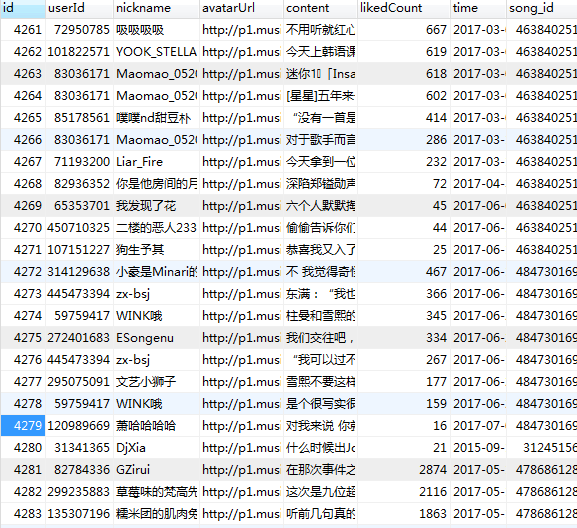

# Music163
网易云音乐爬虫

目录
```
(github) ql@ubuntu:~/github/Music163$ tree
.
├── celerybeat-schedule
├── database
│   ├── config.py
│   ├── __init__.py
│   └── tables.py
├── libs
│   ├── data.py
│   ├── __init__.py
│   └── utils.py
├── README.md
├── run.py
└── tasks
    ├── celeryconfig.py
    ├── comment.py
    ├── index.py
    ├── __init__.py
    └── playlist.py

3 directories, 14 files
```

### tasks/
学习使用Celery写的一个网易云音乐爬虫, 所有`worker`位于`tasks`文件夹内, 主要有三个任务:
```
- index: 登录首页
- playlist: 歌单中歌曲列表
- comment: 歌曲热门评论列表
```

### libs/data
该文件为网易云音乐加密方法, 加密的两个参数是根据随机数生成的, 所以直接通过Chrome开发工具来复制了一个值

### 启动
- worker
```
celery -A tasks worker -l info
```
- 定时任务
```
celery beat -A tasks
```



